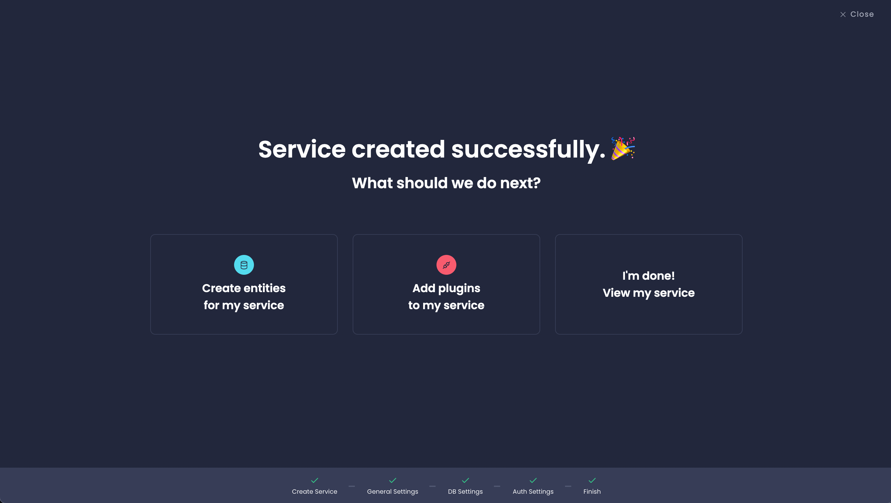

# Create a new Service

This page guides you through the steps of creating a new [Service](/projects-resources-services#services) for your [Project](/projects-resources-services#projects). 

## Step 0: Visit your Project's Dashboard

First, make sure you're on your Project's dashboard. Click on the `Add Resource` button in the top right corner. Click on `Service` on the dropdown that appears.


From here on the Service Creation Wizard will guide you through the process.

## Step 1: Name Your Service

When naming your service, consider its primary function. What will it do? What problem is it solving? An appropriately named service will be easier to identify and maintain.


## Step 2: Connect Your GitHub Repository

Amplication will keep your generated service [synced with a GitHub](/sync-with-github/) repository that you choose.

First, install the Amplication GitHub App into your account or organization.


Next, select the repository where the generated code will be stored.


## Step 3: Customize Your Service

Amplication can generate GraphQL APIs, REST APIs, and an Admin UI for each of your services. Select the components you need for your service.


## Step 4: Select Your Repo Style 

Choose how your service will be stored in your repository: *Monorepo* or *Polyrepo*.

**Monorepo** generates a folder at the root and stores services in specified sub-folders. 

```
./apps
  - apps/my-new-service 
  - apps/my-new-service-admin
```

:::tip
Monorepo is recommended if you plan on having multiple services in a single GitHub repository
:::

**Polyrepo** stores each service in individual folders at the root of your repository.

```
- ./my-new-service
- ./my-new-service-admin
```


## Step 5: Choose Your Database

Amplication supports PostgreSQL, MongoDB, and MySQL out of the box. Choose the one that suits your needs.

:::tip
You're not locked into your choice - you can always change your database type later in your project's plugin page.
:::


## Step 6: Define Your Data Model

Define entities and fields for your database. You can manually define your own or use a template provided by Amplication.

:::info
Entities are the objects you want to keep track of in your app, like a User or a Product. They become tables in your database. Each row represents an instance of the entity.

A field is a column in that table that represents an attribute of that entity.
:::


## Step 7: Include Authentication (Optional)

You can optionally choose to include all the necessary code for [authentication](/authentication/) in your service. If your service does not require authentication, select the `Skip Authentication` option.


## You're Done!

Congratulations! You've successfully set up your first service on Amplication. You will now be taken to a screen where Amplication will start generating all the necessary code for your service. You can watch this happen in real time.


Clicking on the `View my code` button will take you to the GitHub repository you chose in Step 2. Specifically, you'll see Amplication's first commit to that repository.

If you're curious about what the generated code for a service looks like, we have an example on GitHub for you. Check out the following repository:

[Amplication Generated Service Sample App](https://github.com/amplication/sample-app)


